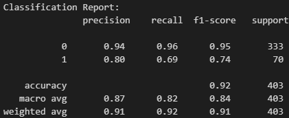

# Seer_Breast_Cancer

# Goal
The goal of this project was to create a prototype of a classification model that uses data from the SEER (Surveillance, Epidemiology, and End Results) dataset to predict the status (alive or dead) of breast cancer patients.
Scoring results in F1 and recall were the deciding factor for which model will be used and optimized.

# Requirements
* [Python 3.11.4](https://www.python.org/downloads/release/python-3114/)
* [Pandas 2.0.2](https://pandas.pydata.org/)
* [Numpy 1.24.2](https://numpy.org/)
* [Matplotlib 3.7.1](https://matplotlib.org/stable/index.html)
* [scikit-learn 1.2.2](https://scikit-learn.org/stable/)
* [PDPbox 0.3.0](https://pdpbox.readthedocs.io/en/latest/)
* for details see install instructions in requirements.txt

# Dataset
The data is from the aggle website [Seer Breast Cancer Data - Labeled](https://www.kaggle.com/datasets/reihanenamdari/breast-cancer). It is based on the SEER Program of the NCI from 2017 November, providing information on population-based cancer statistics. The dataset involved female patients with infiltrating duct and lobular carcinoma breast cancer (SEER primary cites recode NOS histology codes 8522/3) diagnosed in 2006-2010. Patients with unknown tumour size, examined regional LNs, positive regional LNs, and patients whose survival months were less than 1 month were excluded; thus, 4024 patients were ultimately included.
The target variable contains the values 'Alive' and 'Dead'. Any patient that died after the follow-up cut-off in 2017 was recorded to be alive as of the cut-off date. 

The dataset consists of the following variables:

* Age: Patient age in years.
* Race: Race record is based on the race variables and the American Indian/Native American IHS link variable. This recode should be used to link to the populations for white, black and other. It is independent of Hispanic ethnicity. For more information, see : http://seer.cancer.gov/seerstat/variables/seer/race_ethnicity.
* Marital Status: This data item identifies the patient’s marital status at the time of diagnosis for the reportable tumor.
* T Stage: Classification of how large the primary tumor is in the breast and what its biomarkers are. For more information see http://seer.cancer.gov/seerstat/variables/seer/ajcc-stage/6th.
* N Stage: Classification regarding the tumor spread to the lymph nodes and to, where, what size, and how many lymph nodes are positive. For more information see http://seer.cancer.gov/seerstat/variables/seer/ajcc-stage/6th.
* 6th Stage: Stage groups for breast cancer. Doctors assign the stage of the cancer by combining the T, N, and M classifications. For more information see http://seer.cancer.gov/seerstat/variables/seer/ajcc-stage/6th.
* Grade and differentiate: Describes and classifies how well a tumor cell is differentiated. Higher graded tumors have the most abnormal looking cells.
* A Stage: Regional — A neoplasm that has extended 1) beyond the limits of the organ of origin directly into surrounding organs or tissues; 2) into regional lymph nodes by way of the lymphatic system; or 3) by a combination of extension and regional lymph nodes. 
Distant — A neoplasm that has spread to parts of the body remote from the primary tumor either by direct extension or by discontinuous metastasis (e.g., implantation or seeding) to distant organs, issues, or via the lymphatic system to distant lymph nodes.
* Tumor Size: Information on tumor size in millimeters.
* Estrogen Status: Hormone receptor status in cancer cells.
* Progesterone Status: Hormone receptor status in cancer cells.
* Regional Node Examined: Records the total number of regional lymph nodes that were removed and examined by the pathologist.
* Reginol Node Positive: Records the exact number of regional lymph nodes examined by the pathologist that were found to contain metastases. 
* Survival Months: Survival since diagnosis in months.
* Status: ['Alive', 'Dead'] Any patient that dies after the follow-up cut-off date is recoded to be alive as of the cut-off date.

# Data Processing
After testing and optimizing multiple models with GridSearches (DecisionTreeClassifier, RandomForestClassifier, Logistic Regression and Support Vector Machine), the RandomForestClassifier provided the best scoring combination in F1 and recall.
All necessary steps were included in Pipelines (transforming columns, encoding and instantiating models).
Feature engineering:
*  introducing new features 'Node_Exam_Pos_Rate' and 'Estrogen_Progesteron_Status'
*  one-hot-encoding nominal categorical features
*  relabeling ordinal categorical features
*  scaling for polynomial features
*  creating polynomial features
*  fitting/predicting RandomForest model

# Metrics
Comparing different models, RandomForest classifier with polynomial features of second degree yielded the best results. 

  
# Model Interpretation
Extracting feature importances and using partial dependence plots (PDP) to examine the influence of selected features on predictions.

